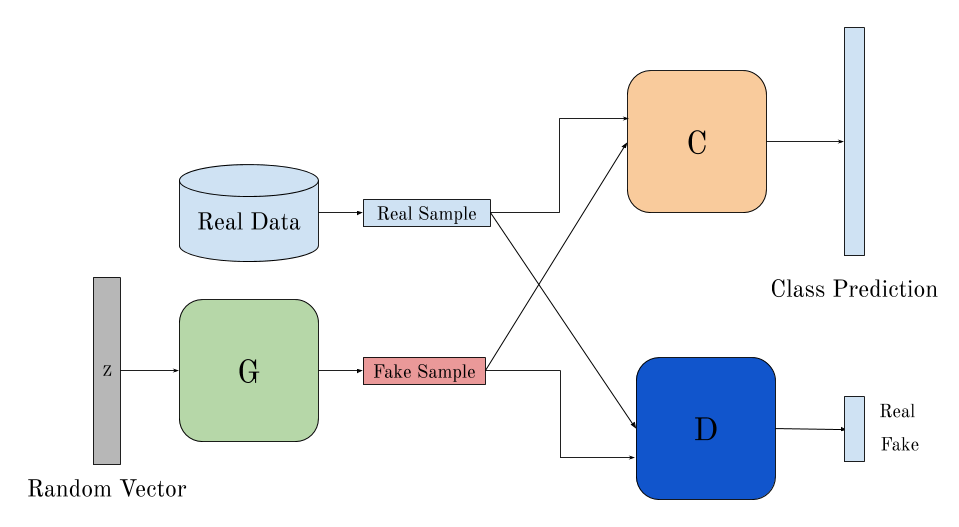

## This repo contains a Generative Adversarial Network trained on the MNIST dataset. 
This is a part of my research in the Indiana University Computer Vision Lab. More advancements from here developing another CNN based external classifier that would also help in creating more labelled data through semi-supevised methods and convert the traditional two-player game to a three-player game.
Another direction to go would be convert the GAN into a DC-GAN, since the literature suggest better results.

Below is a model representation of a EC-GAN(External Classifier GAN), that uses a CNN along with a discriminator to classify the GAN samples.

My current implementation shows 88% accuracy with this model, that code is not shared here since it's still under research.